IRCTC Mini Backend System
==========================

Overview
--------

This project is a simplified IRCTC-style backend system that provides APIs for user registration and authentication, train search and management, seat booking,
and analytics based on API logs stored in MongoDB.

The system is designed to demonstrate:

- Clean API design using Django REST Framework (DRF)
- Relational modelling of users, trains, and bookings in MySQL
- Use of MongoDB for API logging and analytics
- JWT-based authentication for protecting APIs


Tech Stack
---------

- Python 3.x
- Django 6.x
- Django REST Framework
- MySQL (transactional data)
- MongoDB (API logs and analytics)
- JWT authentication (djangorestframework-simplejwt)
- drf-spectacular (OpenAPI/Swagger documentation)


Key Features & Architecture
---------------------------

### 1. Concurrency & Data Integrity
- **Pessimistic Locking**: Uses `SELECT FOR UPDATE` in MySQL to lock train rows during bookings
- **Atomic Transactions**: Ensures that seat availability and booking creation happen together or not at all
- **Race Condition Prevention**: Prevents double-booking of the same seat

### 2. Dynamic Pricing
- **Base Price**: Each train has a configurable base price
- **Surge Charging**: 25% surcharge applied when available seats drop below 20% of total capacity
- **Price Persistence**: Booking price is stored at the moment of purchase for historical accuracy

### 3. MongoDB Analytics & Logging
- **Automatic Request Logging**: Every train search is logged to MongoDB with:
  - Endpoint, method, timestamp
  - User information (id, email, is_staff)
  - Query parameters and filters
  - Execution time and result count
  - IP address and user agent
- **Aggregation Pipeline**: MongoDB aggregation pipeline groups searches by route and counts occurrences

### 4. Database Indexing
- **Composite Index**: Created on (source, destination) fields in Train table for fast search queries
- **Unique Index**: Train number is indexed for quick lookups

### 5. Authentication & Authorization
- **JWT Tokens**: Access tokens for API requests, Refresh tokens for token renewal
- **Role-Based Access Control**: Admin-only endpoints for train creation and management
- **Permission Classes**: Fine-grained permission control using DRF permission classes


Project Structure
-----------------

```text
irctc/
├── pyproject.toml          # dependencies
├── README.md
└── backend/                # Django format - project level
		├── manage.py
		├── backend/
		│   ├── settings.py
		│   ├── urls.py
		│   ├── asgi.py
		│   └── wsgi.py
		├── user/           # app level - for user registration, login
		├── trains/         # app level - for adding, searching trains
		├── bookings/       # app level - for booking train
		└── analytics/      # app level - for analytics
```

Environment Configuration
-------------------------

Create a `.env` file at the project root and fill it up, as given in the .env.example

```dotenv
MONGO_USER=<YOUR-MONGO-DB-USER>
MONGO_PASSWORD=<YOUR-MONGO-DB-PASSWORD>
MONGO_URI=<MONGODB-URI>
MONGO_DB_NAME=<MONGODB-DATABASE-NAME>

MYSQL_DB=<MYSQL-DB-NAME>
MYSQL_USER=<MYSQL-USERNAME>
MYSQL_PASSWORD=<MYSQL-PASSWORD>
MYSQL_HOST=<MYSQL-HOSTNAME>
MYSQL_PORT=<MYSQL-PORT-KEY>

SECRET_KEY=<GET-A-SECURE-SECRET_KEY>
```

The Django settings file reads the MySQL configuration and MongoDB URI from these environment variables.


Setup Instructions
------------------

1. Clone the repository

	 ```bash
	 git clone https://github.com/Poushali-02/irctc-backend.git
	 cd irctc
	 ```

2. Create and activate a virtual environment (using uv)

	 ```bash
	 uv venv .venv
	 .venv\Scripts\activate  # On Windows
	 # source .venv/bin/activate  # On Linux/macOS
	 ```

3. Sync Dependencies

	 ```bash
	 uv sync
	 ```

4. Configure MySQL

	 - Create a new MySQL database matching `MYSQL_DB` in your `.env` file.
	 - Create a user with the username and password specified in `MYSQL_USER` and `MYSQL_PASSWORD`.
	 - Grant that user privileges on the database.

5. Apply migrations

	 ```bash
	 cd backend
	 uv run manage.py migrate
	 ```

6. Create a superuser (for admin and train management)

	 ```bash
	 uv run manage.py createsuperuser
	 ```

7. Run the development server

	 ```bash
	 uv run manage.py runserver
	 ```


Authentication and JWT
----------------------

The project uses JWT authentication via `djangorestframework-simplejwt`.

- On successful registration or login, an access token (and refresh token) is issued.
- All protected endpoints must be called with the header:

	```http
	Authorization: Bearer <access_token>
	```

By default, access tokens have a limited lifetime and can be refreshed using the refresh token.


API Documentation
-----------------

Interactive API documentation is available via drf-spectacular:

- Swagger UI: `http://localhost:8000/api/docs/`
- OpenAPI schema: `http://localhost:8000/api/schema/`
- Redoc: `http://localhost:8000/api/redoc/`


API Overview
------------

Base URL during development:

```text
http://localhost:8000/
```

All application APIs are namespaced under `/api/`.


## Authentication APIs

**Register a new user**

- Endpoint: `POST /api/register/`
- Description: Register a new user by name, email, and password. Returns JWT tokens.

- Request body example:

- ```json
    {
        "name": "Test User",
        "email": "user@example.com",
        "password": "strongpassword123"
    }
    ```
- 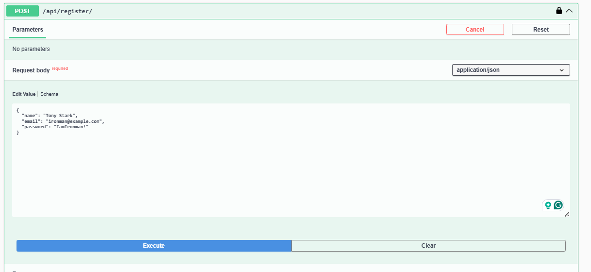

- Response example:

- ```json
    {
        "user": {
            "id": 1,
            "name": "Test User",
            "email": "user@example.com"
        },
        "access": "<access_token>",
        "refresh": "<refresh_token>"
    }
    ```
- 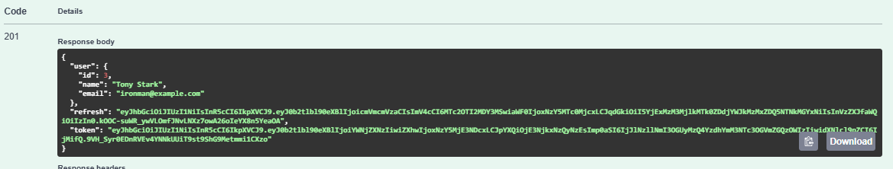
**Login**

- Endpoint: `POST /api/login/`
- Description: Authenticate with email and password. Returns JWT tokens.

- Request body example:

- ```json
    {
        "email": "user@example.com",
        "password": "strongpassword123"
    }
    ```
- 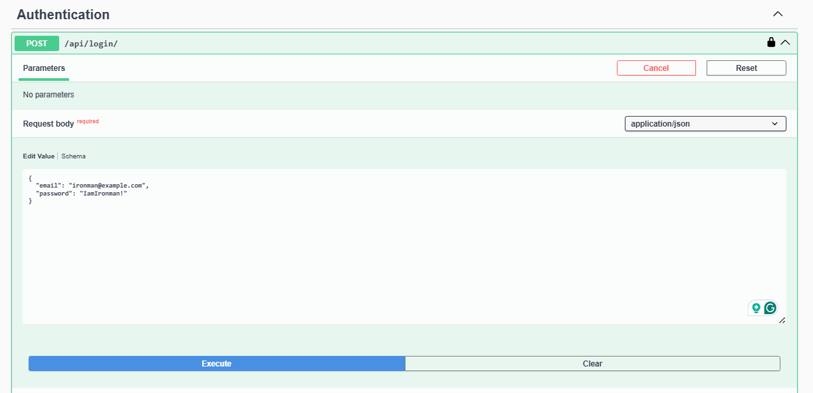

- Response example:

- ```json
    {
        "access": "<access_token>",
        "refresh": "<refresh_token>"
    }
    ```
- 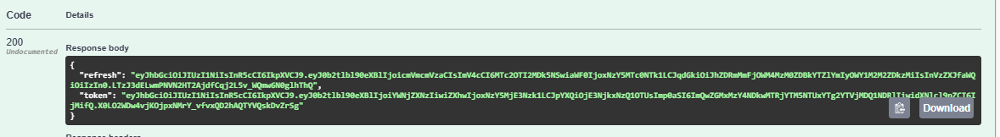

All other APIs require the `Authorization: Bearer <access_token>` header.
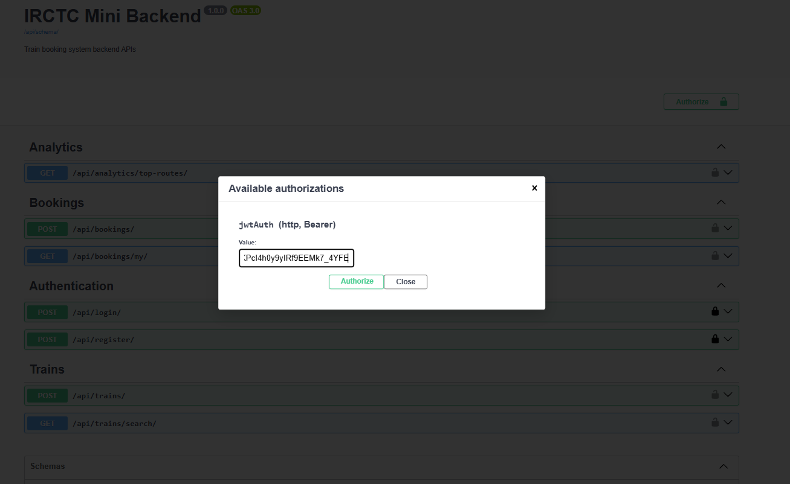


## Train APIs

**Search trains**

- Endpoint: `GET /api/trains/search/`
- Authentication: Required (any authenticated user)
- Description: Search trains between two stations, with optional filters.

Query parameters:

- `source` (optional): Filter by source station (partial, case-insensitive)
- `destination` (optional): Filter by destination station (partial, case-insensitive)
- `date` (optional): Filter by departure date in `YYYY-MM-DD` format
- `limit` (optional): Pagination limit (if pagination is enabled)
- `offset` (optional): Pagination offset (if pagination is enabled)

Example request:

```http
GET /api/trains/search/?source=Delhi&destination=Mumbai&date=2026-01-25 HTTP/1.1
Host: localhost:8000
Authorization: Bearer <access_token>
```

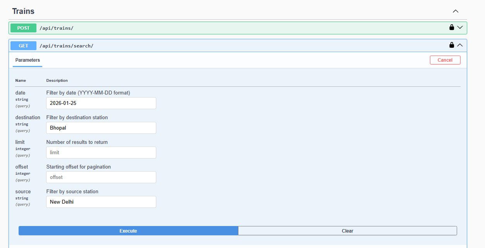
Example paginated response:

```json
{
	"count": 2,
	"next": null,
	"previous": null,
	"results": [
		{
			"id": 1,
			"train_number": "12951",
			"name": "Mumbai Rajdhani Express",
			"source": "Mumbai Central",
			"destination": "New Delhi",
			"departure_time": "2026-01-25T16:35:00Z",
			"arrival_time": "2026-01-26T08:35:00Z",
			"total_seats": 1000,
			"available_seats": 850
		}
	]
}
```
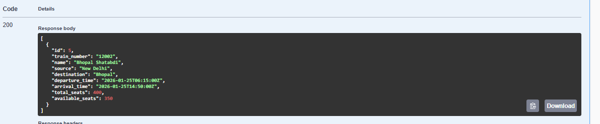

Each search request is logged into MongoDB with details such as endpoint, query parameters, user,
execution time, and result count.

**Mongo db document**

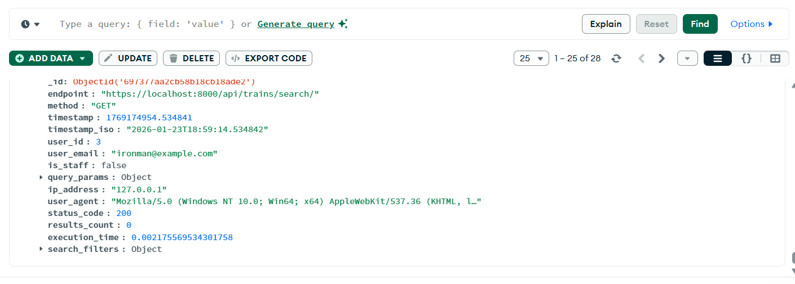

## Booking APIs

**Book seats on a train**

- Endpoint: `POST /api/bookings/`
- Authentication: Required (authenticated user)
- Description: Create a booking after validating seat availability and deducting available seats
	atomically. Calculates dynamic pricing with surge charging.

Key Features:
- **Pessimistic Locking**: Uses `select_for_update()` to lock train rows and prevent race conditions
- **Atomic Transaction**: Ensures either all operations complete or none (data integrity)
- **Dynamic Pricing**: Base price × seats booked
- **Surge Charging**: Adds 25% surcharge when available seats ≤ 20% of total seats

Request body example:

```json
{
	"train": 1,
	"seats_booked": 2
}
```
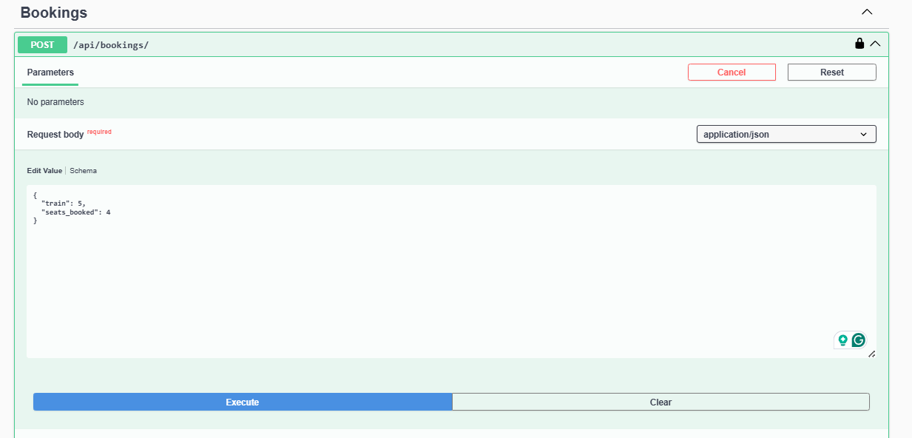

Response example:

```json
{
	"booking": {
		"id": 10,
		"train": 1,
		"seats_booked": 2,
		"price": 1500.50
	}
}
```
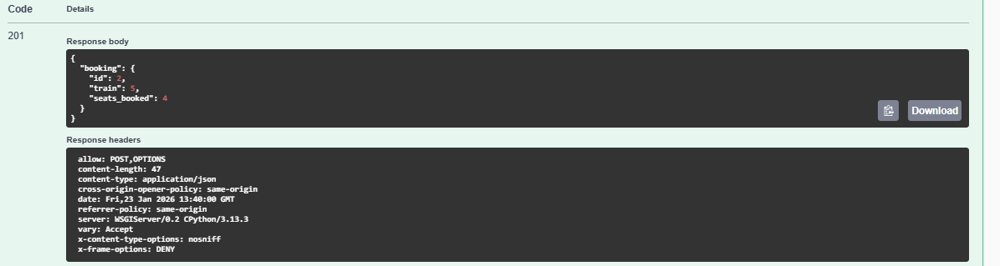

**List bookings of the logged-in user**

- Endpoint: `GET /api/bookings/my/`
- Authentication: Required (authenticated user)
- Description: Returns all bookings made by the current user, including train details.

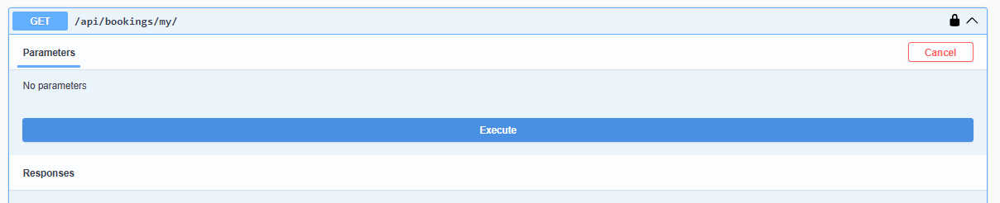

Example response:

```json
[
	{
		"id": 10,
		"train": {
			"id": 1,
			"train_number": "12951",
			"name": "Mumbai Rajdhani Express",
			"source": "Mumbai Central",
			"destination": "New Delhi"
		},
		"seats": 2,
		"booking_time": "2026-01-23T10:30:00Z",
		"confirmed": true
	}
]
```
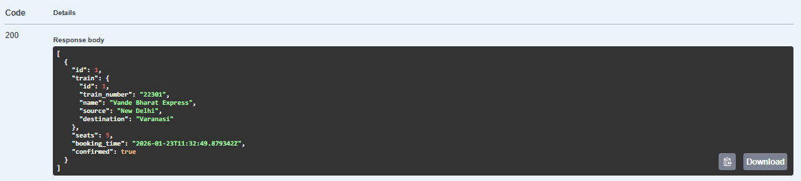

**List all bookings (Admin)**

- Endpoint: `GET /api/bookings/all/`
- Authentication: Required (authenticated user)
- Description: Returns all bookings in the system with train and user details (typically admin view).

Example response:

```json
[
	{
		"id": 1,
		"train": {
			"id": 1,
			"train_number": "12951",
			"name": "Mumbai Rajdhani Express",
			"source": "Mumbai Central",
			"destination": "New Delhi"
		},
		"seats": 2,
		"booking_time": "2026-01-23T10:30:00Z",
		"confirmed": true
	}
]
```

## Analytics API

**Top searched routes**

- Endpoint: `GET /api/analytics/`
- Authentication: Required (authenticated user)
- Description: Aggregates MongoDB logs of train search requests and returns the top five most
	searched `(source, destination)` route combinations using MongoDB aggregation pipeline.

MongoDB Aggregation Pipeline:
- Filters for `/trains/search` endpoints only
- Extracts source and destination from query parameters
- Groups by (source, destination) pair
- Counts occurrences and sorts in descending order
- Skips first 5 results and limits to 5 more

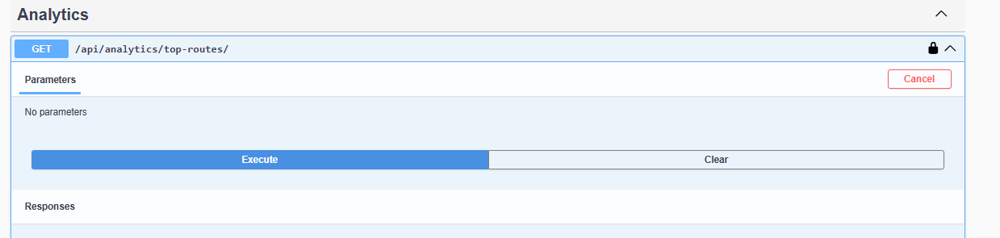

Example response:

```json
[
	{
		"source": "Delhi",
		"destination": "Mumbai",
		"search_count": 15
	},
	{
		"source": "Mumbai",
		"destination": "Delhi",
		"search_count": 12
	}
]
```
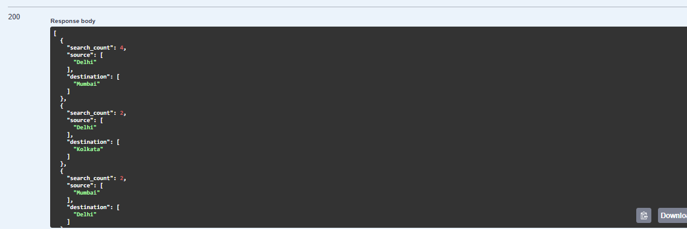

# Additional Features

## User APIs

**Get all users with bookings**

- Endpoint: `GET /api/users/booked/`
- Authentication: Required (authenticated user)
- Description: Returns list of all users who have made at least one booking.

Example response:

```json
[
	{
		"id": 1,
		"name": "Test User",
		"email": "user@example.com",
		"is_staff": false
	}
]
```

# Admins Only
## Adding Trains API
**Add trains with details**
- Endpoint: `POST /api/trains/`
- Authentication: Required (authenticated User)
- Admin Access: Required (User should be admin)
- Description: Creates and returns a comprehensive train route with pricing information.

Request body example:
```json
{
  "train_number": "31224",
  "name": "Jammu Tawi Rajdhani",
  "source": "Jammu Tawi",
  "destination": "New Delhi",
  "departure_time": "2026-01-23T12:51:55.556Z",
  "arrival_time": "2026-01-23T12:51:55.556Z",
  "total_seats": 420,
  "available_seats": 420
}
``` 
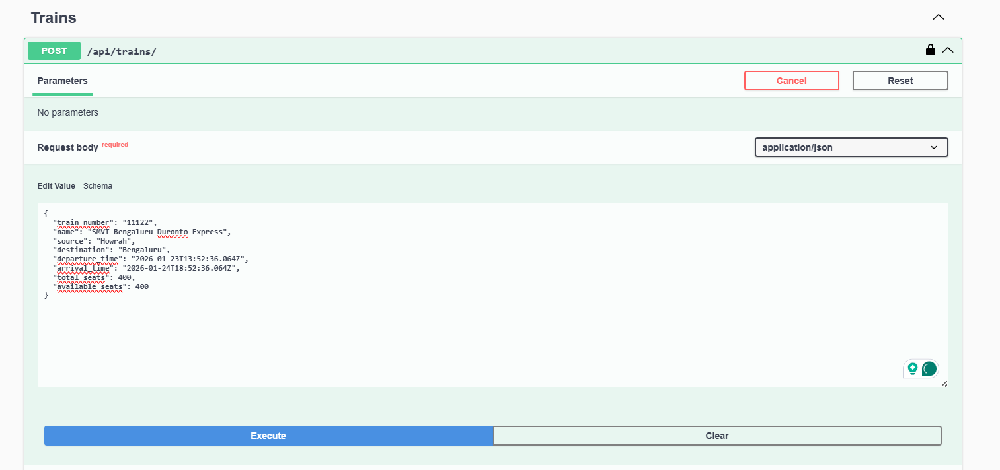
Example Response:
```json
{
  "train": {
    "id": 34,
    "train_number": "31224",
    "name": "Jammu Tawi Rajdhani",
    "source": "Jammu Tawi",
    "destination": "New Delhi",
    "departure_time": "2026-01-23T12:51:55.556000Z",
    "arrival_time": "2026-01-23T12:51:55.556000Z",
    "total_seats": 420,
    "available_seats": 420
  }
}
```
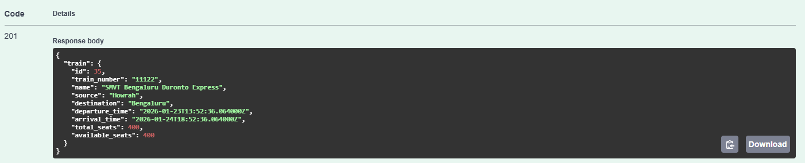

## MongoDB Logging

MongoDB is used to store API analytics logs such as train search requests.

Each search request stores:
- endpoint
- method
- timestamp
- timestamp_iso
- user_id
- user_email
- is_staff
- query_params
- ip_address
- user_agent
- status_code
- results_count
- execution_time

### Sample Document
See `docs/mongo_samples/api_logs_sample.json`


Testing and Verification
------------------------

- Ensure MySQL and MongoDB are running and reachable with the credentials specified in `.env`.
- Run `uv run python manage.py check` to verify Django configuration.
- Use `uv run python populate_trains.py` to seed train data and generate search logs.
- Use Swagger UI (`/api/docs/`) to exercise all endpoints and verify request/response formats.
